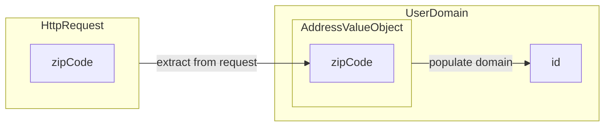

# CLAUDE.md

This file provides guidance to Claude Code (claude.ai/code) when working with code in this repository.

## プロジェクト概要

`lineage-to-graph` は、YAML/JSON形式で定義したカラム単位のデータリネージ情報を、Markdown + Mermaid図へ自動変換するツールです。

## セットアップ

### 必須環境
- Python 3.8+
- Rye（推奨）

### 依存関係のインストール

**Rye使用時（推奨）:**
```bash
# 依存関係のインストール
rye sync
```

**pipを直接使用する場合:**
```bash
pip install -r requirements.txt
```

または直接インストール:
```bash
pip install PyYAML
```

## 基本的なコマンド

### リネージ変換の実行
```bash
python lineage_to_md.py data/sample.yml data/output/output.md

# lint
md-mermaid-lint data/output/output.md                                    
```

### スキーマバリデーション（オプション）
```bash
pip install jsonschema
jsonschema -i data/sample.yml schema.json
```

## アーキテクチャ

### コア変換ロジック ([lineage_to_md.py](lineage_to_md.py))

このプロジェクトは単一のPythonスクリプトで構成されており、以下の3つの主要フェーズで動作します:

1. **モデル解析フェーズ** ([lineage_to_md.py:26-36](lineage_to_md.py#L26-L36))
   - YAMLの`models`セクションからモデル名、タイプ(`program`/`datastore`)、プロパティを抽出
   - 各フィールドのMermaidノードID(`{model}_{field}`形式)を生成し、`field_node_ids`辞書に格納
   - モデルごとのフィールドリストを`field_nodes_by_model`に保存

2. **Mermaidサブグラフ生成フェーズ** ([lineage_to_md.py:47-54](lineage_to_md.py#L47-L54))
   - モデルごとにMermaidサブグラフを生成
   - フィールドをサブグラフ内のノードとして配置
   - タイプに応じたCSSクラス(`program`/`datastore`)を適用

3. **リネージエッジ生成フェーズ** ([lineage_to_md.py:68-82](lineage_to_md.py#L68-L82))
   - `lineage`配列の各エントリを処理
   - `from`が`Model.field`形式の場合は既存ノードIDを使用
   - それ以外(リテラル値)の場合は`ensure_literal()`でリテラルノードを動的生成
   - `transform`プロパティがあればエッジラベルとして表示

### ノードID生成ルール ([lineage_to_md.py:4-12](lineage_to_md.py#L4-L12))

`slug()`関数は安全なMermaid識別子を生成します:
- `::` は `_` に変換
- 英数字とアンダースコア以外を `_` に変換
- 連続するアンダースコアを1つにまとめる
- 数字で始まる場合は `n_` をプレフィックス

### リテラル値、フィールド参照、モデル参照の区別

リネージの`from` / `to`値は以下のように解釈されます:

1. **モデル参照**: `model_types`に登録されているモデル名
   - 例: `HttpRequest`, `UserDomain.AddressValueObject`
   - Mermaidのサブグラフ全体を指す
   - 用途: モデル全体からプロパティへのマッピング

2. **フィールド参照**: `Model.field`形式で`field_node_ids`に存在
   - 例: `HttpRequest.amount`, `UserDomain.id`
   - 特定のプロパティノードを指す

3. **リテラル値**: 上記以外
   - 例: `JP`, `now()`, `v1.0`
   - 専用のリテラルノードを動的生成

**判定順序** ([lineage_to_md.py:376-379](lineage_to_md.py#L376-L379), [lineage_to_md.py:402-411](lineage_to_md.py#L402-L411)):
1. モデル参照チェック(優先)
2. フィールド参照チェック
3. リテラル値として扱う

### スキーマ仕様 ([schema.json](schema.json))

JSON Schemaは以下を定義:
- `spec: "lineage-v1"` - バージョン識別子(必須)
- `models` - モデル定義の配列(name, type, propsが必須)
- `lineage` - エッジ定義の配列(from, toが必須、transformはオプション)
- `from`は文字列または配列が可能
- `to`は必ず`Model.field`形式のパターンを強制

## 階層構造のサポート

### 概要

モデルを入れ子にして階層構造を表現できます。DomainモデルにValueObjectを含める場合などに使用します。

### スキーマ定義

[schema.json](schema.json) の `models[].children` プロパティを使用:

```yaml
models:
  - name: TransactionDomain
    type: program
    props: [id, userId, createdAt]
    children:
      - name: MoneyValueObject
        type: program
        props: [amount, currency]
      - name: MetadataValueObject
        type: program
        props: [source, version]
```

### フィールド参照記法

階層構造のフィールドは `Parent.Child.field` 形式で参照:

```yaml
lineage:
  - from: HttpRequest.amount
    to: TransactionDomain.MoneyValueObject.amount
  - from: JP
    to: TransactionDomain.MoneyValueObject.currency
```

### Mermaid出力

入れ子サブグラフとして出力されます:

```mermaid
subgraph TransactionDomain[TransactionDomain]
  TransactionDomain_id["id"]:::property

  subgraph TransactionDomain_MoneyValueObject[MoneyValueObject]
    TransactionDomain_MoneyValueObject_amount["amount"]:::property
    TransactionDomain_MoneyValueObject_currency["currency"]:::property
  end
end
```

### 実装詳細

- **再帰的パース** ([lineage_to_md.py:33-91](lineage_to_md.py#L33-L91))
  - `parse_models_recursive()` が親子関係を辿ってモデル階層を構築
  - 親のプレフィックスを子に伝播 (`Parent.Child` 形式)
  - フィールドIDを `{parent}_{child}_{field}` で生成

- **入れ子サブグラフ生成** ([lineage_to_md.py:93-140](lineage_to_md.py#L93-L140))
  - `generate_subgraph()` がインデントレベルを管理
  - 子モデルを親サブグラフ内に再帰的に配置

### サンプル

実際の使用例は [data/event-driven.yml](data/event-driven.yml) を参照してください。

## モデル全体参照

### 概要

モデル全体(サブグラフ)から特定のプロパティへ、またはプロパティからモデル全体へ矢印を引くことができます。

### 使用例

```yaml
models:
  - name: HttpRequest
    type: program
    props: [zipCode, prefecture, city, street, building]

  - name: UserDomain
    type: program
    props: [id, name]
    children:
      - name: AddressValueObject
        type: program
        props: [zipCode, prefecture, city, street, building]

lineage:
  # モデル全体 → プロパティ
  - from: HttpRequest
    to: UserDomain.AddressValueObject.zipCode
    transform: "extract from request"

  # 階層モデル → プロパティ
  - from: UserDomain.AddressValueObject
    to: UserDomain.id
    transform: "populate domain"
```

### Mermaid出力



### ユースケース

- **モデル全体からValueObjectへの変換**: HTTPリクエストの複数フィールドをValueObjectにマッピング
- **ValueObjectからDomainへの設定**: 作成したValueObjectをドメインモデルに組み込む
- **一括変換の表現**: 複数プロパティをまとめて扱う処理の可視化

### サンプル

実際の使用例は [data/model_to_field_example.yml](data/model_to_field_example.yml) を参照してください。

## CSVからのモデル読み込み

### 概要

モデル定義をCSVファイルから読み込むことができます。大規模なデータモデルをCSVで管理しつつ、リネージ定義はYAMLで簡潔に記述できます。

### CSV形式

**ファイル名規則**: `論理名__物理名.csv`
- 例: `HTTPリクエスト__HttpRequest.csv`
- 例: `残高__balance_snapshot.csv`

**CSV列定義**:
```csv
論理名,物理名,データ型,サイズ,キー,説明
```
- **program系**: 最初の3列(論理名,物理名,データ型)
- **datastore系**: 全6列

**使用される列**:
- `物理名`: propsリストの要素として使用
- その他の列: 現在は未使用(将来的にメタデータとして活用可能)

### コマンドライン引数

```bash
python lineage_to_md.py <input.yaml> <output.md> \
  --program-model-dir <dir1> <dir2> ... \
  --datastore-model-dir <dir1> <dir2> ...
```

**引数**:
- `--program-model-dir`: programタイプのモデルCSVが格納されたディレクトリ(複数指定可)
- `--datastore-model-dir`: datastoreタイプのモデルCSVが格納されたディレクトリ(複数指定可)

### 使用パターン

#### パターン1: 完全CSV方式
```yaml
# lineage.yml
spec: lineage-v1
models: []  # 空でOK

lineage:
  - from: HttpRequest.amount
    to: balance_snapshot.total_amount
```

```bash
python lineage_to_md.py lineage.yml output.md \
  --program-model-dir data/レイアウト \
  --datastore-model-dir data/テーブル定義
```

#### パターン2: YAML + CSV混在方式
```yaml
# lineage.yml
spec: lineage-v1
models:
  # 階層構造はYAMLで定義
  - name: TransactionDomain
    type: program
    props: [id, userId]
    children:
      - name: MoneyValueObject
        type: program
        props: [amount, currency]

lineage:
  - from: HttpRequest.amount  # ← CSVから読み込み
    to: TransactionDomain.MoneyValueObject.amount
```

#### パターン3: 完全YAML方式(既存互換)
```yaml
# 従来通り、すべてYAMLに定義
spec: lineage-v1
models: [...]
lineage: [...]
```

```bash
# --model-dirs不要
python lineage_to_md.py sample.yml output.md
```

### 実装詳細

- **CSV読み込み** ([lineage_to_md.py:19-83](lineage_to_md.py#L19-L83))
  - `load_model_from_csv()`: CSVファイルを読み込んでモデル定義を返す
  - ファイル名から物理名(モデル名)を抽出
  - エンコーディング自動判定(UTF-8 → CP932 → Shift_JIS)

- **モデル探索** ([lineage_to_md.py:119-166](lineage_to_md.py#L119-L166))
  - `find_model_csvs()`: 指定ディレクトリから必要なモデルCSVを探索
  - `**/*.csv`パターンで再帰的に検索

- **参照モデル抽出** ([lineage_to_md.py:85-117](lineage_to_md.py#L85-L117))
  - `extract_referenced_models()`: lineageから参照されているモデル名を抽出

- **統合ロジック** ([lineage_to_md.py:293-345](lineage_to_md.py#L293-L345))
  - YAML定義のモデルを優先
  - 不足分をCSVから補完
  - 重複チェックと警告メッセージ

### サンプル

実際の使用例は [data/event-driven-csv.yml](data/event-driven-csv.yml) を参照してください。

## CSVモデルのフィールドフィルタリング

### 概要

CSVから読み込んだモデルについて、リネージで実際に使用されているフィールドのみをMermaid図に表示します。大規模なCSV定義(数十フィールド)を使用する場合でも、図が読みやすくなります。

### デフォルト動作

**フィルタリング有効**(デフォルト): CSVモデルは使用フィールドのみ表示
- YAML定義のモデルは全プロパティを表示(従来通り)
- CSV由来のモデルはlineageで参照されているフィールドのみ表示
- モデル全体参照(`from: Money`)の場合は全フィールドを表示

### オプション

`--show-all-props` フラグを使用すると、CSVモデルでも全プロパティを表示できます(後方互換性)。

### 使用例

#### サンプルデータ

**CSV定義** ([data/レイアウト/HTTPリクエスト__HttpRequest.csv](data/レイアウト/HTTPリクエスト__HttpRequest.csv)): 27フィールド
```csv
論理名,物理名,データ型
リクエストID,request_id,String
ユーザーID,user_id,String
金額,amount,String
タイムスタンプ,timestamp,String
IPアドレス,ip_address,String
ユーザーエージェント,user_agent,String
... (さらに20+フィールド)
```

**リネージ定義** ([data/event-driven-csv.yml](data/event-driven-csv.yml)): 4フィールドのみ使用
```yaml
lineage:
  - { from: HttpRequest.request_id, to: TransactionDomain.id }
  - { from: HttpRequest.user_id, to: TransactionDomain.userId }
  - { from: HttpRequest.timestamp, to: TransactionDomain.createdAt }
  - { from: HttpRequest.amount, to: Money.amount }
```

#### 実行コマンド

```bash
# デフォルト: 使用フィールドのみ表示 (4フィールド)
python lineage_to_md.py data/event-driven-csv.yml output_filtered.md \
  --program-model-dir data/レイアウト \
  --datastore-model-dir data/テーブル定義

# --show-all-props: 全プロパティ表示 (27フィールド)
python lineage_to_md.py data/event-driven-csv.yml output_all.md \
  --program-model-dir data/レイアウト \
  --datastore-model-dir data/テーブル定義 \
  --show-all-props
```

#### 出力の違い

**フィルタリング有効版** (デフォルト):
```mermaid
subgraph HttpRequest[HttpRequest]
  HttpRequest_request_id["request_id"]:::property
  HttpRequest_user_id["user_id"]:::property
  HttpRequest_amount["amount"]:::property
  HttpRequest_timestamp["timestamp"]:::property
end
```
→ **4フィールドのみ表示** (使用しているものだけ)

**全プロパティ版** (`--show-all-props`):
```mermaid
subgraph HttpRequest[HttpRequest]
  HttpRequest_request_id["request_id"]:::property
  HttpRequest_user_id["user_id"]:::property
  HttpRequest_amount["amount"]:::property
  HttpRequest_timestamp["timestamp"]:::property
  HttpRequest_ip_address["ip_address"]:::property
  HttpRequest_user_agent["user_agent"]:::property
  HttpRequest_referer["referer"]:::property
  ... (さらに20+フィールド)
end
```
→ **27フィールド全て表示** (CSVの全定義)

### 効果

- **図の簡潔化**: 大規模CSV(50+フィールド)でも、使用部分だけが可視化される
- **可読性向上**: 不要な情報が省かれ、データフローに集中できる
- **柔軟性**: `--show-all-props`で全体像も確認可能

### 実装詳細

- **使用フィールド抽出** ([lineage_to_md.py:134-217](lineage_to_md.py#L134-L217))
  - `extract_referenced_fields()`: lineageから実際に使用されているフィールドを抽出
  - モデル全体参照も検出し、その場合は全フィールドをマーク

- **フィルタリングロジック** ([lineage_to_md.py:284-366](lineage_to_md.py#L284-L366))
  - `parse_models_recursive()`: CSV由来のモデルのみフィルタリング
  - YAML定義のモデルは従来通り全プロパティを表示

- **メイン処理** ([lineage_to_md.py:417-485](lineage_to_md.py#L417-L485))
  - `show_all_props` パラメータで動作を制御
  - CSV由来モデルを追跡して適切にフィルタリング

### 比較サンプル

実際の出力比較:
- フィルタリング有効版: [data/output/event-driven-csv_filtered.md](data/output/event-driven-csv_filtered.md)
- 全プロパティ版: [data/output/event-driven-csv_all_props.md](data/output/event-driven-csv_all_props.md)

## props省略可能化と動的フィールド生成

### 概要

YAML定義のモデルで`props`を省略可能にし、lineageで参照されたフィールドを自動的に生成します。これにより、モデルの骨格（name + type）だけを定義し、詳細なプロパティはlineageから逆算する柔軟な記述が可能になります。

**重要**: この機能はYAML定義のモデルのみに適用されます。外部ファイル（CSV/OpenAPI/AsyncAPI）は従来通り、propsが空の場合は警告を出してスキップします。

### 機能の特徴

- **props省略**: modelsでname + typeのみ定義すればOK
- **動的フィールド生成**: lineage参照から自動的にpropsを生成
- **階層構造の自動作成**: 未定義の子モデルも動的に作成
- **型の継承**: 子モデルは親のtypeを継承
- **情報メッセージ**: 動的生成時にstdoutへメッセージ出力

### スキーマの変更

**schema.json**:

- `required: ["name", "type"]` - `props`は不要
- `minItems: 0` - 空配列も許可

### 使用例

#### ケース1: フラットなフィールド生成

```yaml
models:
  - name: EmptyModel
    type: program
    # props省略

lineage:
  - from: literal_value1
    to: EmptyModel.field1
  - from: literal_value2
    to: EmptyModel.field2
```

**実行時の出力**:

```text
Info: モデル 'EmptyModel' はプロパティ未定義のため、lineage参照から動的生成します
```

**生成されるMermaid**:

```mermaid
subgraph EmptyModel[EmptyModel]
  EmptyModel_field1["field1"]:::property
  EmptyModel_field2["field2"]:::property
end
class EmptyModel program_bg
```

#### ケース2: 階層構造の動的生成

```yaml
models:
  - name: Parent
    type: datastore
    # props省略、childrenも未定義

lineage:
  - from: source_value
    to: Parent.Child.nestedField
```

**実行時の出力**:

```text
Info: モデル 'Parent.Child' はプロパティ未定義のため、lineage参照から動的生成します
```

**生成されるMermaid**:

```mermaid
subgraph Parent[Parent]
  subgraph Parent_Child[Child]
    Parent_Child_nestedField["nestedField"]:::property
  end
  class Parent_Child datastore_bg
end
class Parent datastore_bg
```

→ `Parent`のtype（datastore）が`Child`に継承されます

#### ケース3: 部分定義との混在

```yaml
models:
  - name: MixedModel
    type: program
    props: [existingField]  # 一部は明示定義

lineage:
  - from: value1
    to: MixedModel.existingField
  - from: value2
    to: MixedModel.dynamicField  # 動的生成
```

→ `existingField`と`dynamicField`の両方が表示されます

### ユースケース

1. **プロトタイピング**: モデル構造が未確定でもリネージを先に定義
2. **段階的な詳細化**: まずデータフローを記述し、後でプロパティを整理
3. **軽量な定義**: 大量のモデルを扱う際、必要最小限の情報だけを記述
4. **リバースエンジニアリング**: 既存のデータフロー図からモデル定義を逆算

### 実装詳細

- **動的生成関数** ([lineage_to_md.py:479-705](lineage_to_md.py#L479-L705))
  - `create_dynamic_models_from_lineage()`: lineageからフィールド参照を抽出し、モデルを更新
  - 既存モデルのprops更新と、未定義子モデルの作成を実施
  - 親のtypeを子に継承
- **メイン処理での統合** ([lineage_to_md.py:1096-1109](lineage_to_md.py#L1096-L1109))
  - `parse_models_recursive()`の前に動的生成を実行
  - 生成後のモデル定義を通常のパース処理に渡す

### 外部ファイルとの違い

| 項目 | YAML定義モデル | CSV/OpenAPI/AsyncAPI |
|------|---------------|----------------------|
| props省略 | ✅ 可能 | ❌ 不可 |
| 動的生成 | ✅ 実行される | ❌ 実行されない |
| 空props時の動作 | lineageから生成 | 警告を出してスキップ |

### 動的生成サンプル

実際の使用例:

- フラット構造: [data/test-dynamic-fields.yml](data/test-dynamic-fields.yml)
- 階層構造: [data/test-nested-dynamic.yml](data/test-nested-dynamic.yml)

## 実装時の注意点

### 新機能追加時

- `slug()`関数を使用してMermaid識別子を生成し、構文エラーを防ぐ
- `field_node_ids`辞書を使用して既存フィールド参照を解決
- リテラル値は`ensure_literal()`でlineage定義ごとに一意のノードとして動的生成（各リネージの独立性を保つため）
- 新しいモデルタイプを追加する場合はCSSクラス定義も追加 ([lineage_to_md.py:41-43](lineage_to_md.py#L41-L43))

### スキーマ拡張時

- [schema.json](schema.json) の`enum`値を更新(例: 新しい`type`)
- `examples`セクションに使用例を追加して検証可能にする

## 開発ルール

### コード変更時の必須チェック

コードを変更した際は、以下のチェックを必ず実行してください:

#### 1. Mermaid構文チェック (md-mermaid-lint)

生成されたMarkdownファイルがMermaid構文として正しいかを確認します。

```bash
# 個別ファイルのチェック
md-mermaid-lint data/output/output.md

# サンプル全体のチェック
md-mermaid-lint data/output/*.md
```

**チェック内容:**

- Mermaid構文の妥当性
- ノードID、エッジの正しさ
- サブグラフの適切なネスト

#### 2. Unit Test

Domainレイヤーのロジックが正しく動作することを確認します。

```bash
# すべてのunit testを実行
rye run pytest tests/

# カバレッジ付きで実行
rye run pytest --cov=lineage_to_md --cov-report=html tests/

# HTMLカバレッジレポート表示
open htmlcov/index.html
```

**テスト内容:**

- Domainレイヤーの全8クラス（91テストケース）
- Given/When/Then方式
- テストメソッド名: `{対象メソッド名}_xxxの場合_yyyであること` 形式
- 複合条件カバレッジを重視

**テスト対象クラス:**

- `ModelDefinition` - モデル定義のエンティティ
- `LineageEntry` - リネージエントリのエンティティ
- `FieldReference` - フィールド参照の値オブジェクト
- `Models` - ModelDefinitionのコレクション
- `LineageEntries` - LineageEntryのコレクション
- `ReferencedModels` - 参照モデル名の集合
- `ModelInstances` - モデルインスタンスのマップ
- `UsedFields` - 使用フィールドのマップ

#### 3. E2Eテスト（リグレッションテスト）

既存機能が壊れていないことを確認します。

```bash
# すべてのテストケースを実行
bash tests_e2e/lineage_to_md/test.sh

# 期待値の更新（意図的な変更の場合のみ）
bash tests_e2e/lineage_to_md/test.sh --update
```

**テスト内容:**

- README.md「個別生成」セクションの全コマンド（8テストケース）
- 期待される出力との完全一致を確認

**テスト失敗時の対応:**

1. 差分を確認し、意図した変更かどうかを判断
2. 意図した変更の場合: `--update` フラグで期待値を更新
3. 意図しない変更の場合: コードを修正して再テスト

### 開発フロー

```bash
# 1. コード変更
vim lineage_to_md.py

# 2. Unit test実行（Domainレイヤー変更時）
rye run pytest tests/

# 3. 動作確認
python lineage_to_md.py data/sample.yml data/output/sample.md

# 4. Mermaid構文チェック
md-mermaid-lint data/output/sample.md

# 5. E2Eテスト（リグレッションテスト）
bash tests_e2e/lineage_to_md/test.sh

# 6. すべてパスしたらコミット
git add .
git commit -m "feat: ..."
```

### E2Eテストケース一覧

E2Eテスト（リグレッションテスト）で実行される8つのテストケース:

1. **sample** - 基本的なフィールドマッピング
2. **event-driven** - 階層構造、複数ソース、多段階処理
3. **event-driven-csv** - CSV読み込み、モデル→フィールド参照
4. **instance_example** - モデルインスタンス（YAML）
5. **instance_csv_example** - モデルインスタンス（CSV）
6. **api_example** - OpenAPI + AsyncAPI
7. **dynamic-fields** - props省略 + 動的生成
8. **etl-pipeline** - 1:N マッピング、ETL多段階処理

各テストケースの詳細は [tests_e2e/lineage_to_md/test.sh](tests_e2e/lineage_to_md/test.sh) を参照してください。
