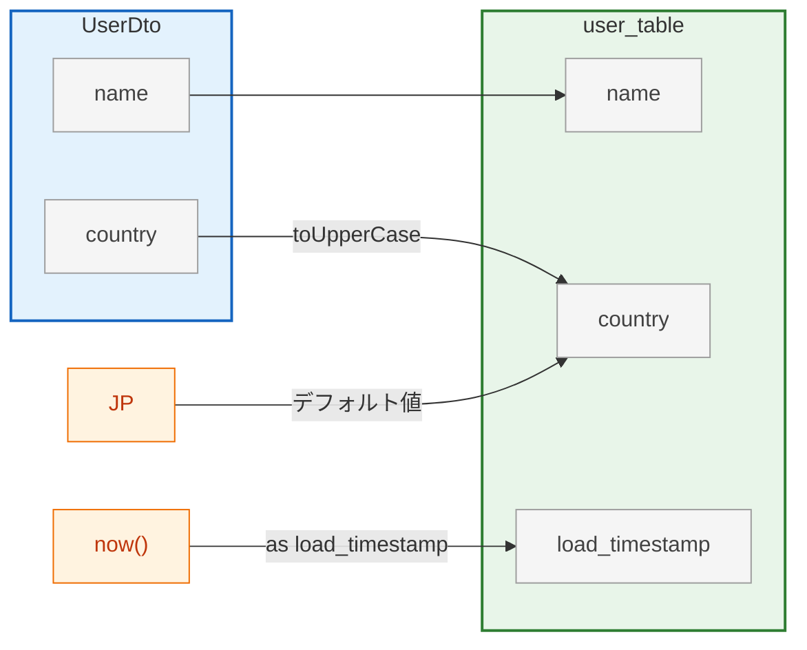

# 🧩 lineage-to-graph

**Column-level Data Lineage Visualization Tools**

## Schema定義

[schema.json](./schema.json)

```yml
spec: lineage-v1

models:
  - name: UserDto
    type: program
    props: [name, country]

  - name: user_table
    type: datastore
    props: [name, country, load_timestamp]

lineage:
  - { from: UserDto.name,    to: user_table.name }
  - { from: UserDto.country, to: user_table.country, transform: toUpperCase }
  - { from: JP,              to: user_table.country, transform: デフォルト値 }
  - { from: now(),           to: user_table.load_timestamp, transform: as load_timestamp }
```



## リポジトリ構成

```
lineage-to-graph/
├── schema.json              # JSON Schema
├── requirements.txt         # Python依存関係
├── lineage_to_md.py         # YAML → Mermaid Markdown 変換スクリプト
└── data/                    # サンプルデータ
```

## schema_validation

```bash
pip install jsonschema
jsonschema -i data/sample.yml schema.json
```

## lineage_to_md

YAML形式で定義した **カラム単位のデータリネージ情報** を **Markdown + Mermaid** 図へ変換するツールです。  
システム設計書・ETLドキュメント・アーキテクチャレビューなどで、軽量かつ一貫したリネージ表現を実現します。


### 機能

| 機能 | 説明 |
|------|------|
| **📜 YAML定義 → Mermaid変換** | 各モデルとカラム、変換関係を記述したYAMLをMarkdownに変換。 |
| **⚡ シンプル構文** | `from`, `to`, `transform` の3要素だけで定義可能。 |
| **🏗️ 階層モデル対応** | モデルを入れ子にして階層構造を表現可能(例: Domain → ValueObject)。 |
| **📁 CSV対応** | モデル定義をCSVファイルから読み込み可能。大規模モデル管理に最適。 |
| **🔗 モデル参照** | モデル全体からフィールドへの参照をサポート(例: `Money → TransactionDomain.money`)。 |
| **🧱 JSON Schema 準拠** | `schema.json` によるバリデーション可能。 |

### 利用方法

#### 1. 依存関係のインストール

Python 3.8+ が必要です。

```bash
pip install -r requirements.txt
```

#### 2. 実行
```bash
python lineage_to_md.py data/sample.yml data/output/output.md
```

### サンプル

| サンプル | 説明 | カバーする機能 | ユースケース |
|---------|------|--------------|-------------|
| **sample.yml** | 最もシンプルな基本例 | フィールド間のマッピング、リテラル値 | REST API → RDB の基本フロー |
| **event-driven.yml** | 多くの機能を網羅 | 階層構造、複数ソース、変換、多段階処理 | DDD + Kafka |
| **event-driven-csv.yml** | CSV + モデル参照 | CSV読み込み、モデル→フィールド参照 | DDD + Kafka |
| **etl-pipeline.yml** | 1カラム→複数カラム | 1:N マッピング、ETL多段階処理 | データレイク/DWH パイプライン |

#### 個別生成

```bash
# 基本サンプル
python lineage_to_md.py data/sample.yml data/output/sample.md

# イベント駆動（階層構造）
python lineage_to_md.py data/event-driven.yml data/output/event-driven.md

# CSV + モデル参照
python lineage_to_md.py data/event-driven-csv.yml data/output/event-driven-csv.md \
  -p data/レイアウト -d data/テーブル定義

# ETLパイプライン
python lineage_to_md.py data/etl-pipeline.yml data/output/etl-pipeline.md
```
