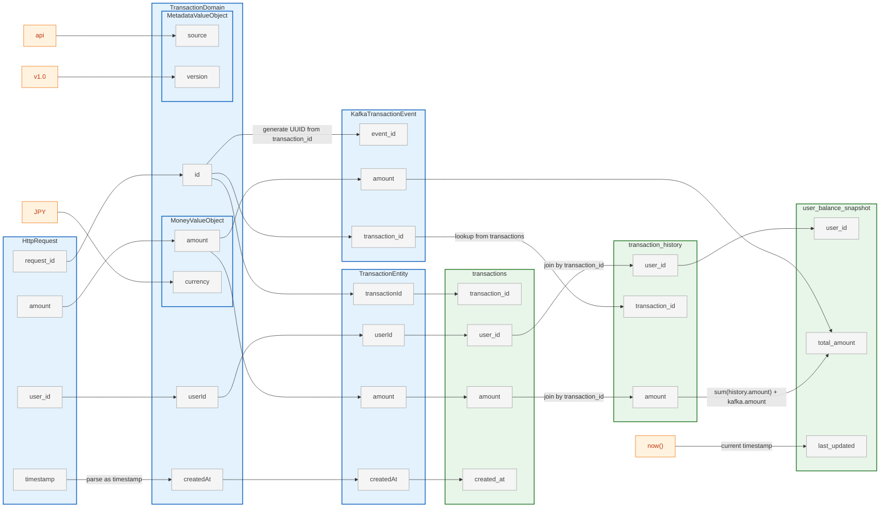

# 🧩 lineage-to-graph

**Column-level Data Lineage → Markdown/Mermaid Graph Converter**

`lineage-to-graph` は、  
YAML または JSON 形式で定義した **カラム単位のデータリネージ情報** を  
自動的に **Markdown + Mermaid** 図へ変換するツールです。  
システム設計書・ETLドキュメント・アーキテクチャレビューなどで、  
軽量かつ一貫したリネージ表現を実現します。




## 🚀 Features

| 機能 | 説明 |
|------|------|
| **📜 YAML定義 → Mermaid変換** | 各モデルとカラム、変換関係を記述したYAMLをMarkdownに変換。 |
| **⚡ シンプル構文** | `from`, `to`, `transform` の3要素だけで定義可能。 |
| **🏗️ 階層モデル対応** | モデルを入れ子にして階層構造を表現可能(例: Domain → ValueObject)。 |
| **🧱 JSON Schema 準拠** | `schema.json` によるバリデーション可能。 |


## 📂 Repository Structure

```
lineage-to-graph/
├── schema.json              # JSON Schema
├── requirements.txt         # Python依存関係
├── data/
│   ├── sample.yml          # 基本サンプル（ETL + 集計）
│   ├── simple.yml          # シンプルな1対1マッピング
│   ├── multi-source.yml    # 複数ソース統合
│   ├── transformation-heavy.yml  # データ変換重視
│   ├── etl-pipeline.yml    # 多段階ETLパイプライン
│   └── event-driven.yml    # イベント駆動アーキテクチャ
└── lineage_to_md.py        # YAML → Mermaid Markdown 変換スクリプト
```


## 🧱 Schema Specification

[schema.json](./schema.json)


## 🧰 Usage

### 1. 依存関係のインストール

Python 3.8+ が必要です。

```bash
pip install -r requirements.txt
```

### 2. 実行
```bash
python lineage_to_md.py data/sample.yml data/output/output.md
```

## 📚 Sample Files & Use Cases

### 1. **simple.yml** - 基本的な1対1マッピング

最もシンプルなフィールド変換。初心者向け。

```bash
python lineage_to_md.py data/simple.yml data/output/simple.md
```

**ユースケース**: REST APIレスポンス → データベーステーブル

### 2. **multi-source.yml** - 複数ソースからの統合

複数のデータソースから1つのターゲットへ統合。

```bash
python lineage_to_md.py data/multi-source.yml data/output/multi-source.md
```

**ユースケース**: CRM、請求、マーケティングデータの顧客マスタ統合

### 3. **transformation-heavy.yml** - データ変換処理のショーケース

型変換、通貨変換、ルックアップなど様々な変換例。

```bash
python lineage_to_md.py data/transformation-heavy.yml data/output/transformation-heavy.md
```

**ユースケース**: 生データのクレンジングと正規化

### 4. **etl-pipeline.yml** - 多段階ETLパイプライン

Raw → Staging → DWH → Mart の4層アーキテクチャ。

```bash
python lineage_to_md.py data/etl-pipeline.yml data/output/etl-pipeline.md
```

**ユースケース**: データレイク/データウェアハウスの実践的なパイプライン

### 5. **event-driven.yml** - イベント駆動アーキテクチャ + 階層モデル

HTTPリクエスト → Domain(ValueObject含む) → RDB → Kafka → サブスクライブ → 集計更新。

```bash
python lineage_to_md.py data/event-driven.yml data/output/event-driven.md
```

**ユースケース**: Kafkaを使ったCQRS/イベントソーシングパターン、DDDのValueObject表現


## 🧪 Schema Validation

YAMLの妥当性をチェックする場合:

```bash
pip install jsonschema
jsonschema -i data/sample.yml schema.json
```
