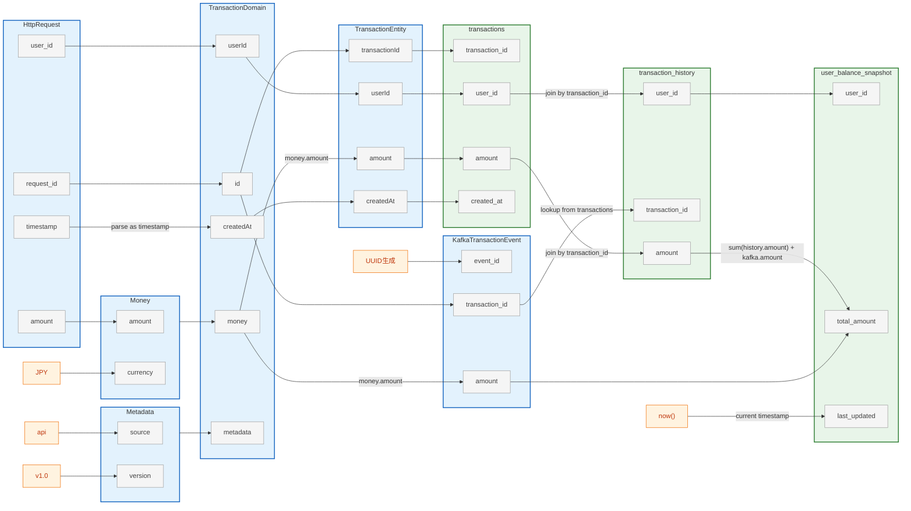

# 🧩 lineage-to-graph

**Column-level Data Lineage → Markdown/Mermaid Graph Converter**

`lineage-to-graph` は、  
YAML または JSON 形式で定義した **カラム単位のデータリネージ情報** を  
自動的に **Markdown + Mermaid** 図へ変換するツールです。  
システム設計書・ETLドキュメント・アーキテクチャレビューなどで、  
軽量かつ一貫したリネージ表現を実現します。



## 🚀 Features

| 機能 | 説明 |
|------|------|
| **📜 YAML定義 → Mermaid変換** | 各モデルとカラム、変換関係を記述したYAMLをMarkdownに変換。 |
| **⚡ シンプル構文** | `from`, `to`, `transform` の3要素だけで定義可能。 |
| **🏗️ 階層モデル対応** | モデルを入れ子にして階層構造を表現可能(例: Domain → ValueObject)。 |
| **📁 CSV対応** | モデル定義をCSVファイルから読み込み可能。大規模モデル管理に最適。 |
| **🔗 モデル参照** | モデル全体からフィールドへの参照をサポート(例: `Money → TransactionDomain.money`)。 |
| **🧱 JSON Schema 準拠** | `schema.json` によるバリデーション可能。 |


## 📂 Repository Structure

```
lineage-to-graph/
├── schema.json              # JSON Schema
├── requirements.txt         # Python依存関係
├── lineage_to_md.py        # YAML → Mermaid Markdown 変換スクリプト
└── data/
    ├── sample.yml          # 基本サンプル
    ├── event-driven.yml    # 全機能を網羅（階層構造、変換、多段階処理）
    ├── event-driven-csv.yml # CSV + モデル参照の実践例
    ├── etl-pipeline.yml    # 1カラム→複数カラムマッピング
    ├── レイアウト/          # CSVモデル定義（program）
    └── テーブル定義/        # CSVモデル定義（datastore）
```


## 🧱 Schema Specification

[schema.json](./schema.json)


## 🧰 Usage

### 1. 依存関係のインストール

Python 3.8+ が必要です。

```bash
pip install -r requirements.txt
```

### 2. 実行
```bash
python lineage_to_md.py data/sample.yml data/output/output.md
```

## 📚 Samples

| サンプル | 説明 | カバーする機能 | ユースケース |
|---------|------|--------------|-------------|
| **sample.yml** | 最もシンプルな基本例 | フィールド間のマッピング、リテラル値 | REST API → RDB の基本フロー |
| **event-driven.yml** | 全機能を網羅した実践例 | 階層構造、複数ソース、変換、多段階処理 | Kafka + DDD（ValueObject）パターン |
| **event-driven-csv.yml** | CSV + モデル参照 | CSV読み込み、モデル→フィールド参照 | 大規模モデル管理 + ValueObject集約 |
| **etl-pipeline.yml** | 1カラム→複数カラム | 1:N マッピング、ETL多段階処理 | データレイク/DWH パイプライン |

### 個別生成

```bash
# 基本サンプル
python lineage_to_md.py data/sample.yml data/output/sample.md

# イベント駆動（階層構造）
python lineage_to_md.py data/event-driven.yml data/output/event-driven.md

# CSV + モデル参照
python lineage_to_md.py data/event-driven-csv.yml data/output/event-driven-csv.md \
  -p data/レイアウト -d data/テーブル定義

# ETLパイプライン
python lineage_to_md.py data/etl-pipeline.yml data/output/etl-pipeline.md
```

### 一括生成

すべてのサンプルを `data/output/` 配下に生成:

```bash
# YAML-onlyサンプル
for file in data/sample.yml data/event-driven.yml data/etl-pipeline.yml; do
  python lineage_to_md.py "$file" "data/output/$(basename "$file" .yml).md"
done

# CSVサンプル
python lineage_to_md.py data/event-driven-csv.yml data/output/event-driven-csv.md \
  -p data/レイアウト -d data/テーブル定義
```

---

## 📁 CSVからモデルを読み込む

大規模なデータモデルをCSVで管理し、リネージ定義はYAMLで記述できます。

### CSV形式

**ファイル名**: `論理名__物理名.csv`

```csv
論理名,物理名,データ型,サイズ,キー,説明
ユーザーID,user_id,VARCHAR,256,PK,
残高,total_amount,NUMBER,10,,
```

### 使用例

実践的なサンプル: [data/event-driven-csv.yml](data/event-driven-csv.yml)

```bash
python lineage_to_md.py \
  -p data/レイアウト \
  -d data/テーブル定義 \
  data/event-driven-csv.yml \
  data/output/event-driven-csv.md
```

このサンプルでは、以下のモデルがCSVから読み込まれます:

- `HttpRequest`, `TransactionDomain`, `Money`, `Metadata`, `TransactionEntity`

---

## 🧪 Schema Validation

YAMLの妥当性をチェックする場合:

```bash
pip install jsonschema
jsonschema -i data/sample.yml schema.json
```
