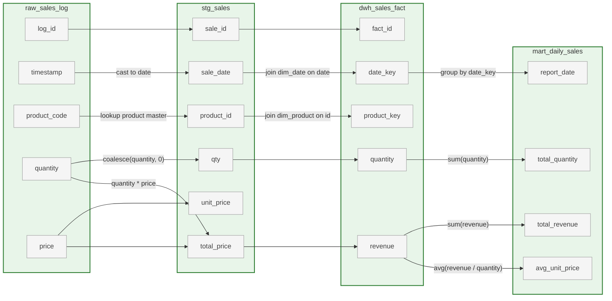

```mermaid
graph LR
  classDef program_bg fill:#E3F2FD,stroke:#1565C0,stroke-width:2px;
  classDef datastore_bg fill:#E8F5E9,stroke:#2E7D32,stroke-width:2px;
  classDef property fill:#F5F5F5,stroke:#9E9E9E,stroke-width:1px,color:#424242;
  classDef literal fill:#FFF3E0,stroke:#EF6C00,stroke-width:1px,color:#BF360C;

    subgraph raw_sales_log[raw_sales_log]
      raw_sales_log_log_id["log_id"]:::property
      raw_sales_log_timestamp["timestamp"]:::property
      raw_sales_log_product_code["product_code"]:::property
      raw_sales_log_quantity["quantity"]:::property
      raw_sales_log_price["price"]:::property
    end
    class raw_sales_log datastore_bg

    subgraph stg_sales[stg_sales]
      stg_sales_sale_id["sale_id"]:::property
      stg_sales_sale_date["sale_date"]:::property
      stg_sales_product_id["product_id"]:::property
      stg_sales_qty["qty"]:::property
      stg_sales_unit_price["unit_price"]:::property
      stg_sales_total_price["total_price"]:::property
    end
    class stg_sales datastore_bg

    subgraph dwh_sales_fact[dwh_sales_fact]
      dwh_sales_fact_fact_id["fact_id"]:::property
      dwh_sales_fact_date_key["date_key"]:::property
      dwh_sales_fact_product_key["product_key"]:::property
      dwh_sales_fact_quantity["quantity"]:::property
      dwh_sales_fact_revenue["revenue"]:::property
    end
    class dwh_sales_fact datastore_bg

    subgraph mart_daily_sales[mart_daily_sales]
      mart_daily_sales_report_date["report_date"]:::property
      mart_daily_sales_total_revenue["total_revenue"]:::property
      mart_daily_sales_total_quantity["total_quantity"]:::property
      mart_daily_sales_avg_unit_price["avg_unit_price"]:::property
    end
    class mart_daily_sales datastore_bg

  raw_sales_log_log_id --> stg_sales_sale_id
  raw_sales_log_timestamp -->|"cast to date"| stg_sales_sale_date
  raw_sales_log_product_code -->|"lookup product master"| stg_sales_product_id
  raw_sales_log_quantity -->|"coalesce(quantity, 0)"| stg_sales_qty
  raw_sales_log_price --> stg_sales_unit_price
  raw_sales_log_quantity -->|"quantity * price"| stg_sales_total_price
  raw_sales_log_price --> stg_sales_total_price
  stg_sales_sale_id --> dwh_sales_fact_fact_id
  stg_sales_sale_date -->|"join dim_date on date"| dwh_sales_fact_date_key
  stg_sales_product_id -->|"join dim_product on id"| dwh_sales_fact_product_key
  stg_sales_qty --> dwh_sales_fact_quantity
  stg_sales_total_price --> dwh_sales_fact_revenue
  dwh_sales_fact_date_key -->|"group by date_key"| mart_daily_sales_report_date
  dwh_sales_fact_revenue -->|"sum(revenue)"| mart_daily_sales_total_revenue
  dwh_sales_fact_quantity -->|"sum(quantity)"| mart_daily_sales_total_quantity
  dwh_sales_fact_revenue -->|"avg(revenue / quantity)"| mart_daily_sales_avg_unit_price
```