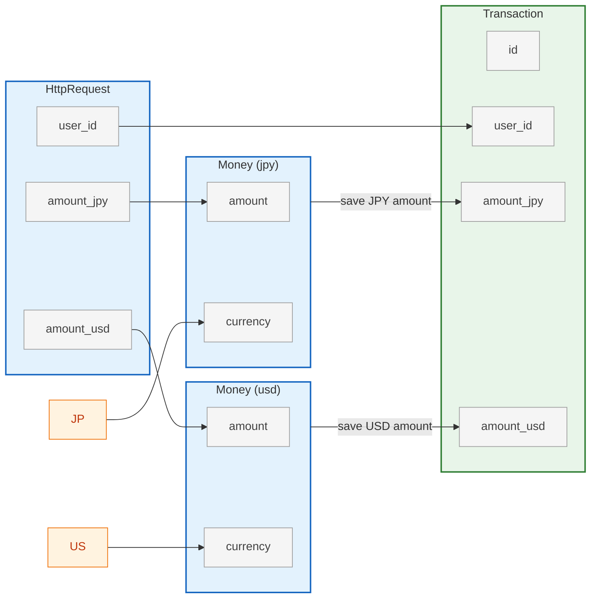

```mermaid
graph LR
  classDef program_bg fill:#E3F2FD,stroke:#1565C0,stroke-width:2px;
  classDef datastore_bg fill:#E8F5E9,stroke:#2E7D32,stroke-width:2px;
  classDef property fill:#F5F5F5,stroke:#9E9E9E,stroke-width:1px,color:#424242;
  classDef literal fill:#FFF3E0,stroke:#EF6C00,stroke-width:1px,color:#BF360C;

    subgraph HttpRequest[HttpRequest]
      HttpRequest_amount_jpy["amount_jpy"]:::property
      HttpRequest_amount_usd["amount_usd"]:::property
      HttpRequest_user_id["user_id"]:::property
    end
    class HttpRequest program_bg

    subgraph Transaction[Transaction]
      Transaction_id["id"]:::property
      Transaction_user_id["user_id"]:::property
      Transaction_amount_jpy["amount_jpy"]:::property
      Transaction_amount_usd["amount_usd"]:::property
    end
    class Transaction datastore_bg

    subgraph Money_jpy["Money (jpy)"]
      Money_jpy_amount["amount"]:::property
      Money_jpy_currency["currency"]:::property
    end
    class Money_jpy program_bg

    subgraph Money_usd["Money (usd)"]
      Money_usd_amount["amount"]:::property
      Money_usd_currency["currency"]:::property
    end
    class Money_usd program_bg

  HttpRequest_amount_jpy --> Money_jpy_amount
  lit_1["JP"]:::literal
  lit_1 --> Money_jpy_currency
  HttpRequest_amount_usd --> Money_usd_amount
  lit_2["US"]:::literal
  lit_2 --> Money_usd_currency
  Money_jpy -->|"save JPY amount"| Transaction_amount_jpy
  Money_usd -->|"save USD amount"| Transaction_amount_usd
  HttpRequest_user_id --> Transaction_user_id

  style Money_jpy fill:#E3F2FD,stroke:#1565C0,stroke-width:2px
  style Money_usd fill:#E3F2FD,stroke:#1565C0,stroke-width:2px
```