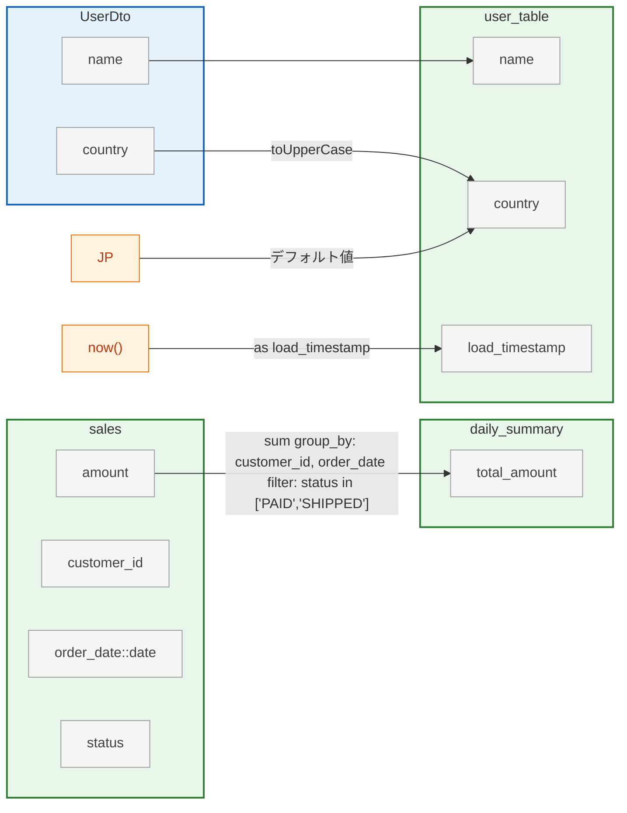

```mermaid
graph LR
  classDef program_bg fill:#E3F2FD,stroke:#1565C0,stroke-width:2px;
  classDef datastore_bg fill:#E8F5E9,stroke:#2E7D32,stroke-width:2px;
  classDef property fill:#F5F5F5,stroke:#9E9E9E,stroke-width:1px,color:#424242;
  classDef literal fill:#FFF3E0,stroke:#EF6C00,stroke-width:1px,color:#BF360C;

    subgraph UserDto[UserDto]
      UserDto_name["name"]:::property
      UserDto_country["country"]:::property
    end
    class UserDto program_bg

    subgraph daily_summary[daily_summary]
      daily_summary_total_amount["total_amount"]:::property
    end
    class daily_summary datastore_bg

    subgraph sales[sales]
      sales_amount["amount"]:::property
      sales_customer_id["customer_id"]:::property
      sales_order_date_date["order_date::date"]:::property
      sales_status["status"]:::property
    end
    class sales datastore_bg

    subgraph user_table[user_table]
      user_table_name["name"]:::property
      user_table_country["country"]:::property
      user_table_load_timestamp["load_timestamp"]:::property
    end
    class user_table datastore_bg

  UserDto_name --> user_table_name
  UserDto_country -->|"toUpperCase"| user_table_country
  lit_1["JP"]:::literal
  lit_1 -->|"デフォルト値"| user_table_country
  lit_2["now()"]:::literal
  lit_2 -->|"as load_timestamp"| user_table_load_timestamp
  sales_amount -->|"sum group_by: customer_id, order_date filter: status in ['PAID','SHIPPED']"| daily_summary_total_amount
```