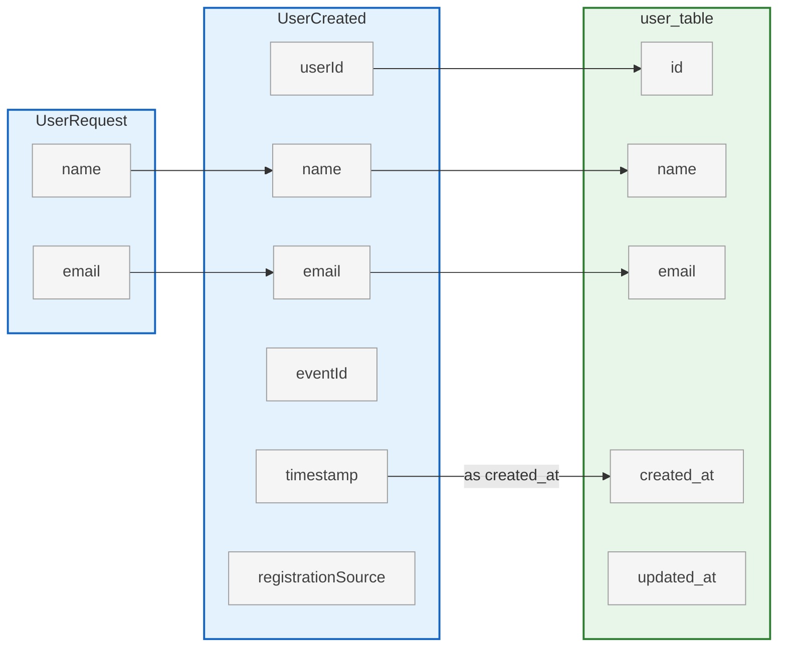

```mermaid
graph LR
  classDef program_bg fill:#E3F2FD,stroke:#1565C0,stroke-width:2px;
  classDef datastore_bg fill:#E8F5E9,stroke:#2E7D32,stroke-width:2px;
  classDef property fill:#F5F5F5,stroke:#9E9E9E,stroke-width:1px,color:#424242;
  classDef literal fill:#FFF3E0,stroke:#EF6C00,stroke-width:1px,color:#BF360C;

    subgraph UserCreated[UserCreated]
      UserCreated_userId["userId"]:::property
      UserCreated_name["name"]:::property
      UserCreated_email["email"]:::property
      UserCreated_eventId["eventId"]:::property
      UserCreated_timestamp["timestamp"]:::property
      UserCreated_registrationSource["registrationSource"]:::property
    end
    class UserCreated program_bg

    subgraph UserRequest[UserRequest]
      UserRequest_name["name"]:::property
      UserRequest_email["email"]:::property
    end
    class UserRequest program_bg

    subgraph user_table[user_table]
      user_table_id["id"]:::property
      user_table_name["name"]:::property
      user_table_email["email"]:::property
      user_table_created_at["created_at"]:::property
      user_table_updated_at["updated_at"]:::property
    end
    class user_table datastore_bg

  UserRequest_name --> UserCreated_name
  UserRequest_email --> UserCreated_email
  UserCreated_userId --> user_table_id
  UserCreated_name --> user_table_name
  UserCreated_email --> user_table_email
  UserCreated_timestamp -->|"as created_at"| user_table_created_at
```