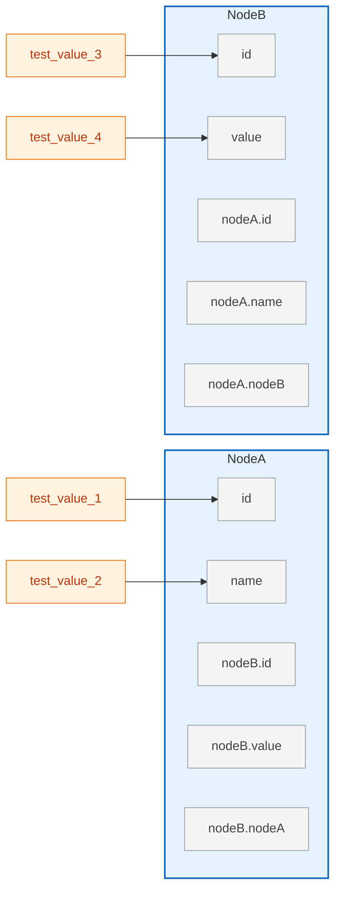

```mermaid
graph LR
  classDef program_bg fill:#E3F2FD,stroke:#1565C0,stroke-width:2px;
  classDef datastore_bg fill:#E8F5E9,stroke:#2E7D32,stroke-width:2px;
  classDef property fill:#F5F5F5,stroke:#9E9E9E,stroke-width:1px,color:#424242;
  classDef literal fill:#FFF3E0,stroke:#EF6C00,stroke-width:1px,color:#BF360C;

    subgraph NodeA[NodeA]
      NodeA_id["id"]:::property
      NodeA_name["name"]:::property
      NodeA_nodeB_id["nodeB.id"]:::property
      NodeA_nodeB_value["nodeB.value"]:::property
      NodeA_nodeB_nodeA["nodeB.nodeA"]:::property
    end
    class NodeA program_bg

    subgraph NodeB[NodeB]
      NodeB_id["id"]:::property
      NodeB_value["value"]:::property
      NodeB_nodeA_id["nodeA.id"]:::property
      NodeB_nodeA_name["nodeA.name"]:::property
      NodeB_nodeA_nodeB["nodeA.nodeB"]:::property
    end
    class NodeB program_bg

  lit_1["test_value_1"]:::literal
  lit_1 --> NodeA_id
  lit_2["test_value_2"]:::literal
  lit_2 --> NodeA_name
  lit_3["test_value_3"]:::literal
  lit_3 --> NodeB_id
  lit_4["test_value_4"]:::literal
  lit_4 --> NodeB_value
```