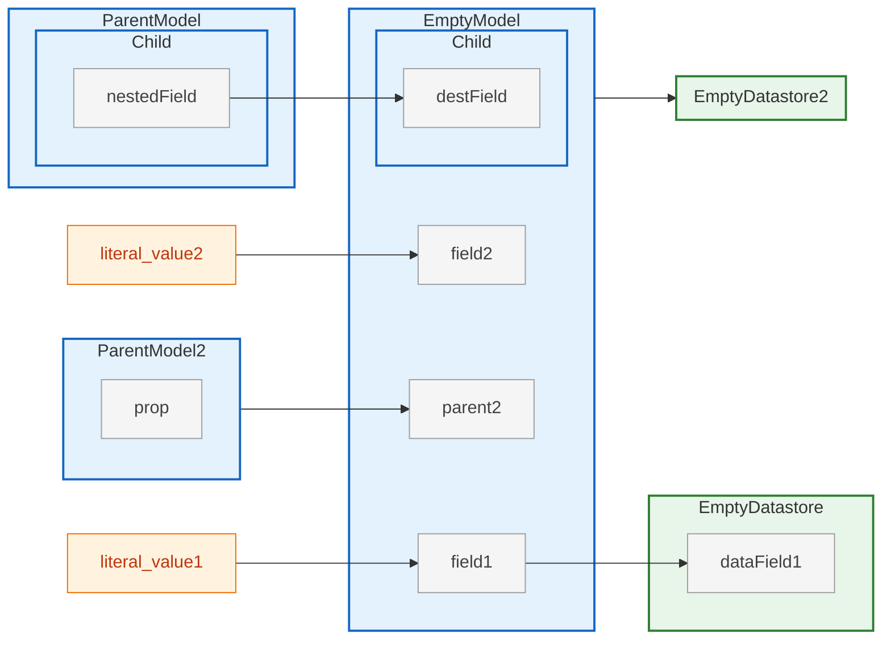

```mermaid
graph LR
  classDef program_bg fill:#E3F2FD,stroke:#1565C0,stroke-width:2px;
  classDef datastore_bg fill:#E8F5E9,stroke:#2E7D32,stroke-width:2px;
  classDef property fill:#F5F5F5,stroke:#9E9E9E,stroke-width:1px,color:#424242;
  classDef literal fill:#FFF3E0,stroke:#EF6C00,stroke-width:1px,color:#BF360C;

    subgraph EmptyDatastore[EmptyDatastore]
      EmptyDatastore_dataField1["dataField1"]:::property
    end
    class EmptyDatastore datastore_bg

    subgraph EmptyDatastore2[EmptyDatastore2]
    end
    class EmptyDatastore2 datastore_bg

    subgraph EmptyModel[EmptyModel]
      EmptyModel_field1["field1"]:::property
      EmptyModel_field2["field2"]:::property
      EmptyModel_parent2["parent2"]:::property

      subgraph EmptyModel_Child[Child]
        EmptyModel_Child_destField["destField"]:::property
      end
      class EmptyModel_Child program_bg
    end
    class EmptyModel program_bg

    subgraph ParentModel[ParentModel]
      subgraph ParentModel_Child[Child]
        ParentModel_Child_nestedField["nestedField"]:::property
      end
      class ParentModel_Child program_bg
    end
    class ParentModel program_bg

    subgraph ParentModel2[ParentModel2]
      ParentModel2_prop["prop"]:::property
    end
    class ParentModel2 program_bg

  lit_1["literal_value1"]:::literal
  lit_1 --> EmptyModel_field1
  lit_2["literal_value2"]:::literal
  lit_2 --> EmptyModel_field2
  EmptyModel_field1 --> EmptyDatastore_dataField1
  ParentModel_Child_nestedField --> EmptyModel_Child_destField
  ParentModel2 --> EmptyModel_parent2
  EmptyModel --> EmptyDatastore2

  style ParentModel2 fill:#E3F2FD,stroke:#1565C0,stroke-width:2px
  style EmptyDatastore2 fill:#E8F5E9,stroke:#2E7D32,stroke-width:2px
  style EmptyModel fill:#E3F2FD,stroke:#1565C0,stroke-width:2px
```