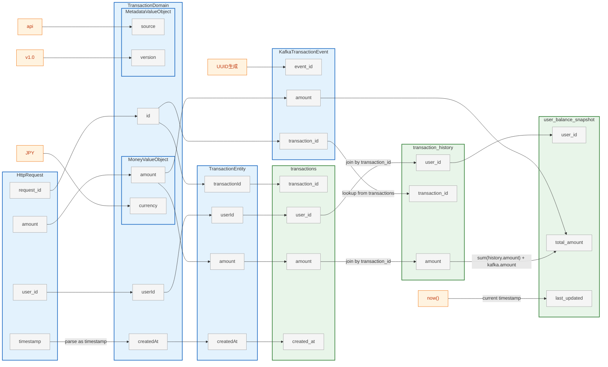

```mermaid
graph LR
  classDef program_bg fill:#E3F2FD,stroke:#1565C0,stroke-width:2px;
  classDef datastore_bg fill:#E8F5E9,stroke:#2E7D32,stroke-width:2px;
  classDef property fill:#F5F5F5,stroke:#9E9E9E,stroke-width:1px,color:#424242;
  classDef literal fill:#FFF3E0,stroke:#EF6C00,stroke-width:1px,color:#BF360C;

    subgraph HttpRequest[HttpRequest]
      HttpRequest_request_id["request_id"]:::property
      HttpRequest_user_id["user_id"]:::property
      HttpRequest_amount["amount"]:::property
      HttpRequest_timestamp["timestamp"]:::property
    end
    class HttpRequest program_bg

    subgraph KafkaTransactionEvent[KafkaTransactionEvent]
      KafkaTransactionEvent_event_id["event_id"]:::property
      KafkaTransactionEvent_transaction_id["transaction_id"]:::property
      KafkaTransactionEvent_amount["amount"]:::property
    end
    class KafkaTransactionEvent program_bg

    subgraph TransactionDomain[TransactionDomain]
      TransactionDomain_id["id"]:::property
      TransactionDomain_userId["userId"]:::property
      TransactionDomain_createdAt["createdAt"]:::property

      subgraph TransactionDomain_MoneyValueObject[MoneyValueObject]
        TransactionDomain_MoneyValueObject_amount["amount"]:::property
        TransactionDomain_MoneyValueObject_currency["currency"]:::property
      end
      class TransactionDomain_MoneyValueObject program_bg
      subgraph TransactionDomain_MetadataValueObject[MetadataValueObject]
        TransactionDomain_MetadataValueObject_source["source"]:::property
        TransactionDomain_MetadataValueObject_version["version"]:::property
      end
      class TransactionDomain_MetadataValueObject program_bg
    end
    class TransactionDomain program_bg

    subgraph TransactionEntity[TransactionEntity]
      TransactionEntity_transactionId["transactionId"]:::property
      TransactionEntity_userId["userId"]:::property
      TransactionEntity_amount["amount"]:::property
      TransactionEntity_createdAt["createdAt"]:::property
    end
    class TransactionEntity program_bg

    subgraph transaction_history[transaction_history]
      transaction_history_user_id["user_id"]:::property
      transaction_history_transaction_id["transaction_id"]:::property
      transaction_history_amount["amount"]:::property
    end
    class transaction_history datastore_bg

    subgraph transactions[transactions]
      transactions_transaction_id["transaction_id"]:::property
      transactions_user_id["user_id"]:::property
      transactions_amount["amount"]:::property
      transactions_created_at["created_at"]:::property
    end
    class transactions datastore_bg

    subgraph user_balance_snapshot[user_balance_snapshot]
      user_balance_snapshot_user_id["user_id"]:::property
      user_balance_snapshot_total_amount["total_amount"]:::property
      user_balance_snapshot_last_updated["last_updated"]:::property
    end
    class user_balance_snapshot datastore_bg

  HttpRequest_request_id --> TransactionDomain_id
  HttpRequest_user_id --> TransactionDomain_userId
  HttpRequest_amount --> TransactionDomain_MoneyValueObject_amount
  lit_1["JPY"]:::literal
  lit_1 --> TransactionDomain_MoneyValueObject_currency
  HttpRequest_timestamp -->|"parse as timestamp"| TransactionDomain_createdAt
  lit_2["api"]:::literal
  lit_2 --> TransactionDomain_MetadataValueObject_source
  lit_3["v1.0"]:::literal
  lit_3 --> TransactionDomain_MetadataValueObject_version
  TransactionDomain_id --> TransactionEntity_transactionId
  TransactionDomain_userId --> TransactionEntity_userId
  TransactionDomain_MoneyValueObject_amount --> TransactionEntity_amount
  TransactionDomain_createdAt --> TransactionEntity_createdAt
  TransactionEntity_transactionId --> transactions_transaction_id
  TransactionEntity_userId --> transactions_user_id
  TransactionEntity_amount --> transactions_amount
  TransactionEntity_createdAt --> transactions_created_at
  TransactionDomain_id --> KafkaTransactionEvent_transaction_id
  lit_4["UUID生成"]:::literal
  lit_4 --> KafkaTransactionEvent_event_id
  TransactionDomain_MoneyValueObject_amount --> KafkaTransactionEvent_amount
  KafkaTransactionEvent_transaction_id -->|"lookup from transactions"| transaction_history_transaction_id
  transactions_user_id -->|"join by transaction_id"| transaction_history_user_id
  transactions_amount -->|"join by transaction_id"| transaction_history_amount
  transaction_history_user_id --> user_balance_snapshot_user_id
  transaction_history_amount -->|"sum(history.amount) + kafka.amount"| user_balance_snapshot_total_amount
  KafkaTransactionEvent_amount --> user_balance_snapshot_total_amount
  lit_5["now()"]:::literal
  lit_5 -->|"current timestamp"| user_balance_snapshot_last_updated
```